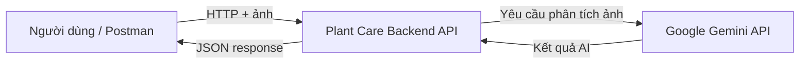
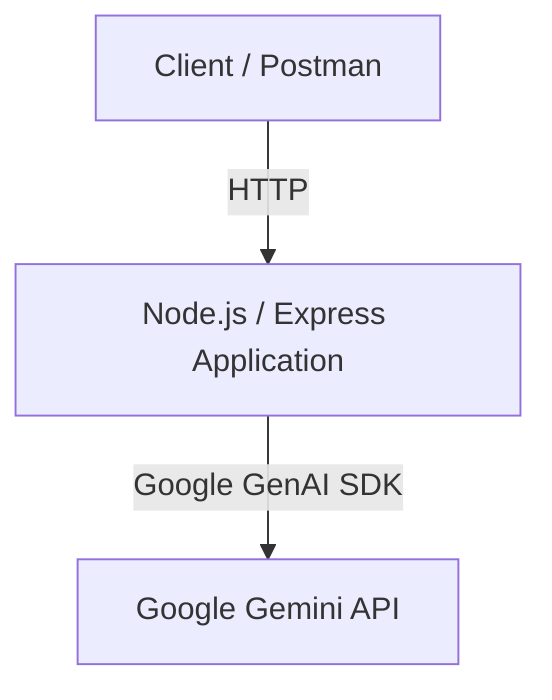
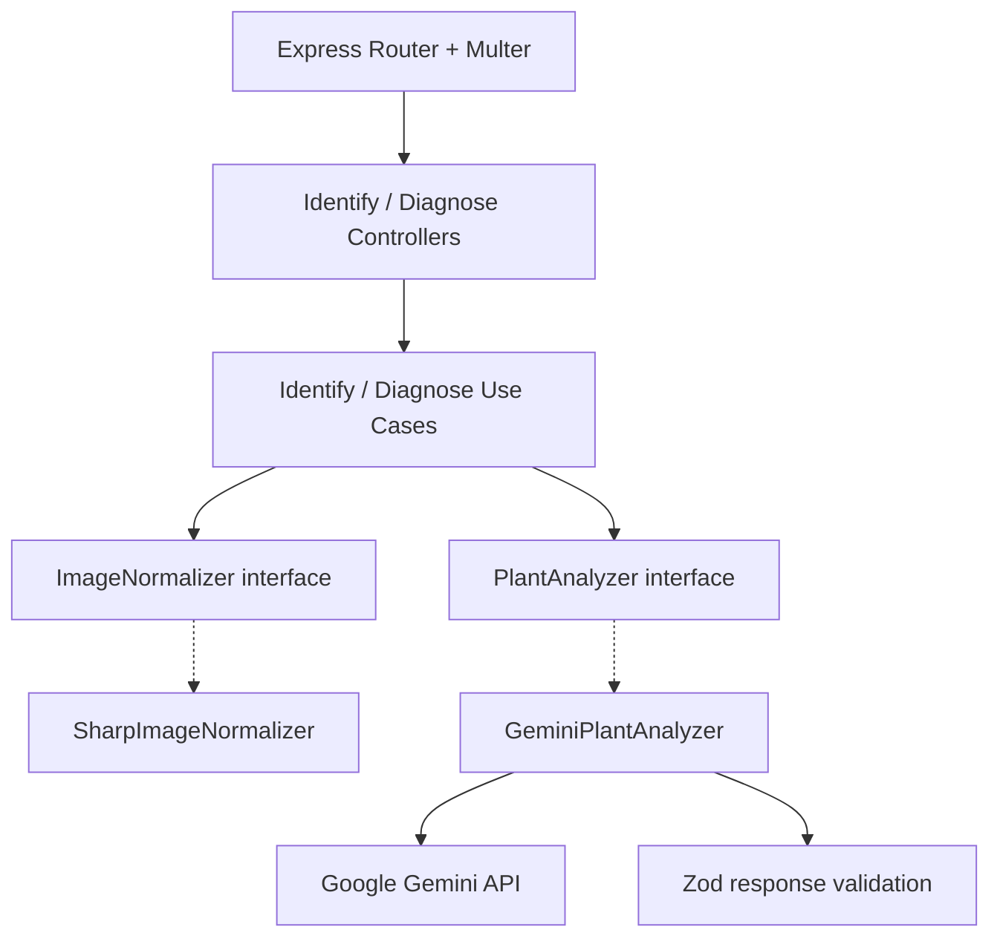

# ARCH-001 — Phân tích kiến trúc hiện tại

## 1. Phạm vi

Tài liệu mô tả **as-is architecture** của Plant Care Backend API tại checkpoint ARCH-001. Không mô tả Redis, PostgreSQL, worker, load balancer hay Docker như những thành phần đã tồn tại.

## 2. C4 — System Context (giản lược)

**Ranh giới:** Client và Google Gemini nằm ngoài tiến trình backend. Gemini là external dependency nên latency, quota và availability của provider ảnh hưởng tới request.

## 3. Container View (triển khai hiện tại)

**Lưu ý C4:** Trong sơ đồ Container, các lớp Controller/UseCase/Adapter không phải các container độc lập; chúng nằm trong cùng một backend application. Phần tiếp theo là **Component View**.

## 4. Component View (giản lược)

`src/app.ts` là nơi khởi tạo các implementation và inject dependency. `PlantAnalyzer` cho phép thay provider mà không bắt buộc UseCase phụ thuộc trực tiếp Google SDK.

## 5. Request flow — Diagnose

1. Client gọi `POST /plants/diagnose`, gửi `plantImage` và `diseaseImage` dạng multipart.
2. Multer tiếp nhận hai file; Controller kiểm tra sự hiện diện và chuyển thành `ImageInput`.
3. UseCase gọi Sharp để chuẩn hóa hai ảnh, giữ đúng ý nghĩa ảnh toàn cây và ảnh vùng có triệu chứng.
4. UseCase gọi `PlantAnalyzer.diagnose()` với hai ảnh đã chuẩn hóa.
5. `GeminiPlantAnalyzer` chuyển ảnh thành image parts, gọi Gemini với instruction và output schema.
6. Adapter parse JSON, kiểm tra dữ liệu bằng Zod và trả `DiagnosePlantResult`.
7. Controller trả JSON; lỗi được chuyển tới error-handling middleware.

## 6. Nhận diện rủi ro (giả thuyết, chưa đo)

| Rủi ro | Vì sao cần quan sát | Cách kiểm chứng tương lai |
|---|---|---|
| Gemini quota / 429 | External API có giới hạn sử dụng | Thử với mock/stub; kiểm tra mã lỗi provider |
| Gemini latency / timeout | Request đồng bộ phải chờ provider | Đo p50/p95 và timeout dưới tải kiểm soát |
| CPU/RAM xử lý ảnh | Sharp tiêu thụ tài nguyên | Đo CPU, RAM và event loop lag |
| File upload lớn | Tăng memory/latency và bề mặt tấn công | Kiểm tra giới hạn file, MIME và ảnh lỗi |
| Một backend instance | Nếu tiến trình dừng thì API không phục vụ | Mô phỏng restart và quan sát downtime |

**Không kết luận bottleneck khi chưa có số liệu.**

## 7. Quyết định hiện tại

Giữ một backend deployable và các abstraction đã có. Chưa bổ sung microservices, queue, cache hoặc load balancer khi chưa xác định vấn đề cụ thể. Xem [ADR-001](../decisions/ADR-001-modular-monolith.md).

## 8. Việc cần xác minh trước khi đóng checkpoint

- [ ] Đối chiếu sơ đồ với branch `main` mới nhất.
- [ ] Chạy `pnpm typecheck` và ghi kết quả thực tế.
- [ ] Chạy `pnpm lint` và ghi kết quả thực tế.
- [ ] Xác nhận hành vi của `/health`, `/plants/identify`, `/plants/diagnose` nếu cần.
- [ ] Link GitHub Issue và Pull Request ARCH-001.
